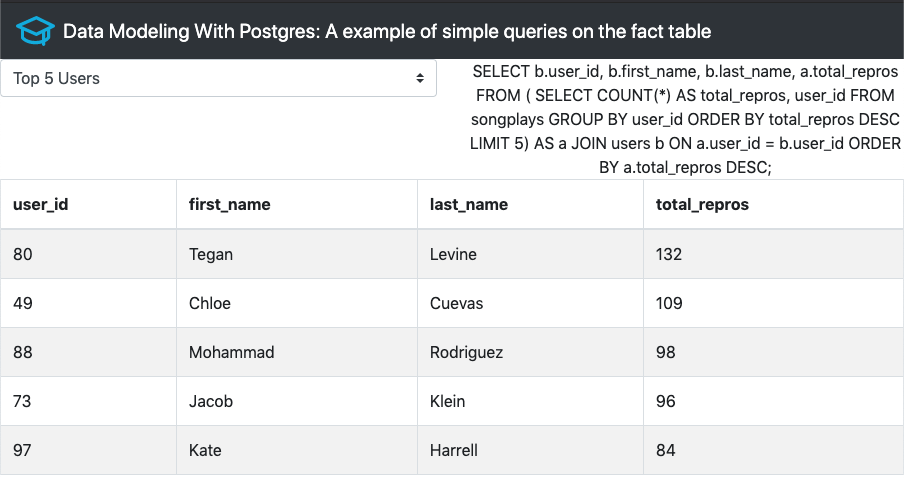

# Data Modeling With Postgres

First project of Udacity's Data Engineer Nanodegree, focused on learning the basics of data modeling using postgres as our primary data storage. This projects goes through the basics of normalization and denomarlization, which in this case is focused on the second one creating a star schema focused on analytical queries.

## Getting Started

The first step is to clone the repository `git clone https://github.com/Gonmeso/Data_Engineer_Nanodegree.git` and then cd into the project `cd 01_data_modeling_with_postgres`

### Prerequisites

To make this project work you will need the following tools:

```
Docker
Docker-Compose
```

Also this project uses a `.env` file where passwords and users should be saved. For the sake of simplicity the `.env`is the following:

```bash
POSTGRES_DB=studentdb
POSTGRES_USER=student
POSTGRES_PASSWORD=student
DATA_DB=sparkifydb
```

### Folder structure

The project is structured as follows

```
├── README.md
├── dashboard                       # Dashboard main folder
│   ├── Dockerfile
│   ├── app.py                      # Fundamental code for the dashboard
│   ├── requirements.txt
│   └── utils.py                    # Functions and variables used in the dashboard
├── dev_env                         # Main folder of the development environment (includes jupyter)
│   ├── Dockerfile
│   ├── create_tables.py            # Completed script to create database and tables
│   ├── data
│   │   ├── log_data
│   │   └── song_data
│   ├── etl.ipynb
│   ├── etl.py                      # Completed script to perform ETL
│   ├── requirements.txt
│   ├── sql_queries.py
│   ├── start.sh
│   └── test.ipynb
├── postgres_db                     # Folder allocating the volume of the docker in order to persist data
├── docker-compose.yml
```

### Running the project

To run the project the only thing you need to to is execute `docker-compose up` and the next steps will be performed:

1. Start the development environment one the Postgres starts accepting connection
2. Create the database and the tables
3. Perform the ETL
4. Then the dashboard will be at `localhost:8050`

Also the `create_tables.py` and `etl.py` could be copied into the Udacity's working environment with one extra need, changing the credentials to connect to the database to the original ones.

## Checking the dashboard

Once the process is finished a dashboard, built with the `dash` python package, will be up at `localhost:8050`. This dashboards shows a selector with example queries, once one is selected the query showed in text will be performend against the database, returning a visualization of the table.



## Authors

* **Gonzalo Mellizo-Soto Díaz**

## Acknowledgments

* Thanks to Udacity for the project!