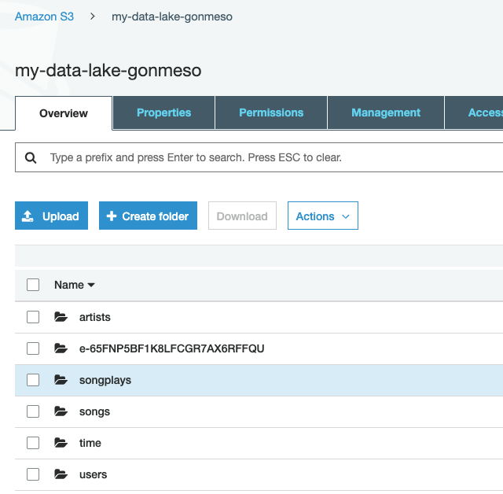
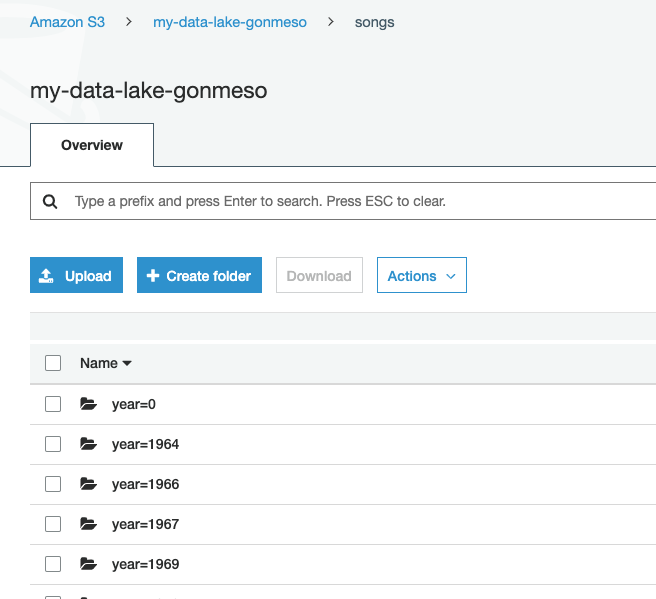
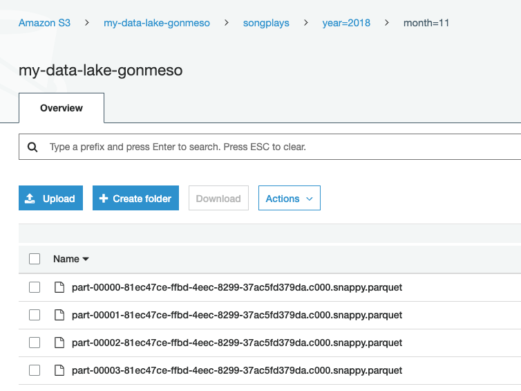

# Data Lake Using Apache Spark

A Data Engineering project focused on learning the basics of Data Modeling using cassandras as the main storage tool, performing ETL's using python.

## Getting Started

The first step is to clone the repository `git clone https://github.com/Gonmeso/Data_Engineer_Nanodegree.git` and then cd into the project `cd 04_Data_Lake`


### Folder structure

The project is structured as follows:

```
.
├── README.md
└── dev_env
    ├── ETL.ipynb
    ├── data_lake.cfg
    ├── etl.py
    ├── etl_emr.ipynb
    └── requirements.txt
```

### Prerequisites

To make this project work you will need the following dependencies:

**Python**: as our main programming language
**virtualenv**: tool to create environments for python, isolating the dependencies for the project
**pip**: Python package installer, used to install the project dependencies
**AWS**: an Amazon Web Services Account in orther to use the Redshift services to build our data warehouse

#### Preparing our Amazon account

1. Creating an IAM user with admin privileges and programatic access
2. Storing the AWS_ACCESS_KEY and AWS_SECRET_KEY safely in order to run our commands usin `boto3`.
3. Create a new EMR cluster where the ETL will be performed.
4. Create a S3 bucket where the tables will be stored.
5. Inlcude all the necessary information at `data_lake.cfg (only for local execution). At this point the credentials and the region can be included (make sure you don't commit the aws credentials to git).

#### Creating a Virtual Environment for local execution

 We have to make sure we are using python 3.6 or above as this projects uses some features not included below python 3.6 as `f-strings`. Run the following command in the `dev_env`folder to create an isolated python environment:

```bash
virtualenv --python python3.6 venv
```

Now the environment must be activated in order to install the dependencies:

```bash
source venv/bin/activate
```

And install our dependencies making use of `pip`:

```bash
pip install -r requirements.txt
```

Now we are ready to start the process.


#### Filling the Data Lake Configuration File

When working locally we use a configuration file that contains all the data necessary to load and write into S3. Due to the use of AWS we must specify the ACCESS and SECRET keys and the S3 buckets used

```cfg
[AWS]
AWS_ACCESS_KEY=
AWS_SECRET_KEY=

[S3]
LOG_DATA=s3a://udacity-dend/log_data
SONG_DATA=s3a://udacity-dend/song_data
OUTPUT_DATA=s3a://my-data-lake-gonmeso
```

When working directly on EMR we have attached a notebook where all the loads and writes are performed, for this case we make no use of the configuration file as we don't need the keys, and the buckets are directly declared as variables.

```python
logs_bucket = 's3a://udacity-dend/log_data'
songs_bucket = 's3a://udacity-dend/song_data'
output_bucket = 's3a://my-data-lake-gonmeso'
```


### Running the project

In order to execute locally you must execute the `etl.py` script:

```bash
python etl.py
```

When executing on a EMR cluster the `etl_emr.ipynb` must be attached to it and executed. As this is not a production process there is no need to submit the script to the cluster, but it would be a good practice doing so.


### Results

Executing the process generates the parquet files in the specified bucket.








## Authors

* **Gonzalo Mellizo-Soto Díaz**

## Acknowledgments

* Thanks to Udacity for the project!