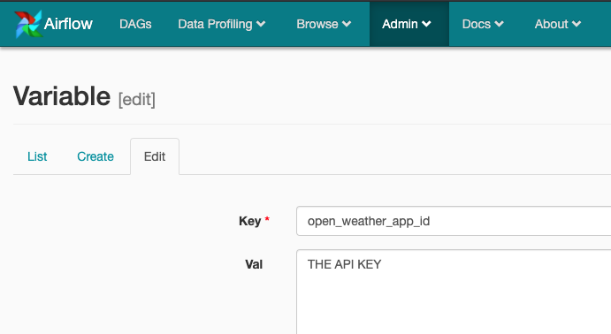

# Capstone Project

This is the Capstone project regarding Udacity's Data Engineer Nanodegree. For this project we will focus in creating an analytical database of the world weather and air quality.

## Scope the Project and Gather Data

The data that will be used for this capstone project is the following:

* [Weather data from OpenWeather](https://openweathermap.org/): weather data as hourly temperature, humidity from any location.

* [Air Quality data from Open AQ](https://openaq.org/#/?_k=88s9eb): air quality data measurments for different parametes as NO2 or CO.

## Explore and Assess the Data

As each data source comes from an API, the data will be formated as a JSON. So lets check our main data sources for this project:

* **Locations data from Open AQ**

From this endpoint we will retrieve the location data that will be used to get the measurements data from Open AQ and the weather data. This endpoint will gives us the starting point by getting the location and the lattitude and longitude that will be used to retrieve weather data. The response from the API looks as following ([docs](https://docs.openaq.org/#api-Locations-GetV1Locations)):

```json
[
  {
    "count": 4242,
    "sourceName": "Australia - New South Wales",
    "firstUpdated": "2015-10-13T01:00:00.000Z",
    "lastUpdated": "2015-11-14T03:00:00.000Z",
    "parameters": [
      "pm25",
      "pm10",
      "so2",
      "co",
      "no2",
      "o3"
    ],
    "country": "AU",
    "city": "Central Coast",
    "location": "Wyong"
  },
  {
    "count": 728,
    "sourceName": "Australia - New South Wales",
    "firstUpdated": "2015-10-13T01:00:00.000Z",
    "lastUpdated": "2015-11-14T03:00:00.000Z",
    "parameters": [
      "pm10"
    ],
    "country": "AU",
    "city": "Central Tablelands",
    "location": "Bathurst"
  },
  ...
]
```

From all this data only `city`, `country`, `location`, `lat` and `lon` we'll be of use to create a dimension table.

* **Measures data from Open AQ**

This endpoint will give us one of our main data sources. This source retrieves measures of specific parameters regarding the air quality in a specific location. The locations gathered by the previous endpoint will dictate which locations (filtered by) data will be requested, both for measures and weather data. The response body is the following ([docs](https://docs.openaq.org/#api-Locations-GetV1Locations)):

```json
 {
  "parameter": "Ammonia",
  "date": {
      "utc": "2015-07-16T20:30:00.000Z",
      "local": "2015-07-16T18:30:00.000-02:00"
  },
  "value": "72.9",
  "unit": "µg/m3",
  "location": "Anand Vihar",
  "country": "IN",
  "city": "Delhi",
  "sourceName": "Anand Vihar",
  "averagingPeriod": {
     "value": 1,
     "unit": "hours"
  },
  "coordinates": {
     "latitude": 43.34,
     "longitude": 23.04
  },
  "attribution": [
    {
      "name" : "SINCA",
      "url" : "http://sinca.mma.gob.cl/"
    },
    {
      "name" : "Ministerio del Medio Ambiente"
    }
  ]
}
```

Using this endpoint multiple values of different parameters will be retrieved and joined with weather data. The `parameter` field indicates which parameter has been measured and the `value` brings it's measure. Also the date of the measure is the joining point with the weather data. For the same date could exist different emasures of parameters in the same location.

* **Weather data from Open Weather**

This API will give us specific values of the weather at a specific place for a single day, bringing hourly data of the weather. Some of the data that will be retrieved is `temperature`, `humidity`, `pressure`, `clouds`, `wind_speed`, `wind_deg` and `weather` description. Also the date that the endpoint brings will be used to join the measures data. For a more extensive documentation you can visit the [api doc](https://openweathermap.org/api/one-call-api) regarding historical data. An example of a response is the following:

```json
  {
  "lat": 60.99,
  "lon": 30.9,
  "timezone": "Europe/Moscow",
  "timezone_offset": 10800
  "current": {
    "dt": 1586468027,
    "sunrise": 1586487424,
    "sunset": 1586538297,
    "temp": 274.31,
    "feels_like": 269.79,
    "pressure": 1006,
    "humidity": 72,
    "dew_point": 270.21,
    "clouds": 0,
    "visibility": 10000,
    "wind_speed": 3,
    "wind_deg": 260,
    "weather": [
      {
        "id": 800,
        "main": "Clear",
        "description": "clear sky",
        "icon": "01n"
      }
    ]
  },
  "hourly": [
    {
      "dt": 1586390400,
      "temp": 278.41,
      "feels_like": 269.43,
      "pressure": 1006,
      "humidity": 65,
      "dew_point": 272.46,
      "clouds": 0,
      "wind_speed": 9.83,
      "wind_deg": 60,
      "wind_gust": 15.65,
      "weather": [
        {
          "id": 800,
          "main": "Clear",
          "description": "clear sky",
          "icon": "01n"
        }
      ]
    },    ...
    }
```

## Define the Data Model

The model is based on joining air quality data and weather data at a specific place and a specific point in time. As this model is focused on creating a table for later data analysis the measures are trated as a fact table and the location, time and weather description are treated as dimension tables. This is focused on analyzing some questions:

* Average measures for a day, week, month
* Compare measures given a city or a country
* How weather affects air quality over time

As stated above, the data model will be as follows:


How this data model is done regarding the data is shown in the next step.

## Data Dictionary

### location_dim_table

* *location_id*: string serving as a location single identifier

* *country*: string with the locations country

* *city*: string with the locations city

* *lat*: float with latitude coordinates

* *lon*: float with longitude coordinates

### weather_dim_table

* *weather_id*: integer serving as a single identifier of the weather

* *main*: string describing the main weather (Rain, Sunny, ...)

* *description*: string further description of weather (Light Rain)

### time_dim_table

* *measure_date*: timestamp regarding the time when the measures have been taken

* *hour*: integer with the extracted hour of the timestamp

* *day*: integer with the extracted day of the timestamp

* *week*: integer with the extracted week of the timestamp

* *month*: integer with the extracted month of the timestamp

* *year*: integer with the extracted year of the timestamp

### measures_fact_table

* *measure_id*: integer identifier for a single measure

* *measure_date*: timestamp regarding the time when the measures have been taken, related to `time_dim_table`

* *location_id*: string serving as a location single identifier, related to `location_dim_table`

* *no2*: float regarding the amount of nitrogen dioxide in the air measured in ppm (particles per million)

* *pm25*: float regarding the amount of particulate matter less than 2.5 micrometers in diameter in the air measured in µg/m³

* *pm10*: float regarding the amount of particulate matter less than 10 micrometers in diameter in the air measured in µg/m³

* *so2*: float regarding the amount of sulfur dioxide in the air measured in ppm (particles per million)

* *o3*: float regarding the amount of ozone in the air measured in ppm (particles per million)

* *co*: float regarding the amount of carbon monoxide in the air measured in ppm (particles per million)

* *bc*: float regarding the amount of black carbon in the air measured in µg/m³

* *temperature*: float of the measure in temperature, measured in celsius

* *pressure*: float of the atmospheric pressure on the sea level, measured in hPa

* *humidity*: percentage of humidity

* *clouds*: percentage of cloudiness

* *wind_speed*: speed of the wind as a float, measured in m/s

* *wind_deg*: wind direction as a float in degrees

* *weather_id*: integer serving as a single identifier of the weather, related to `weather_dim_table`

## Purpuose of the data model

This data models is focused on providing enough information to perform analysis on air quality and weather data regarding a set of aspects:

* Does time affects the air quality?

* Is it related to weather?

* Does seasons have a great impact?

* Is it time related?

* Does the latitud and longitude have a great impact? What about the city?

* ...

As stated before is focused on providing the data source to perform data analysis and provided enough data to anser the questions. As its purpuose its merely analytical it's design for *Data Analysts* or *Data Scientist* that can perform data exploration and gain insights, create a dashboard, forecast air quality, ...

## Run ETL to Model the Data

In orther to create the data model the following steps have been followed:

1. Get location data from Open AQ locations endpoint.
2. Filter out uneeded data and retrieve `country`, `city`, `lat`, `lon` and `location`.
3. Load the locations into a dimension table. This table will be used as base for the next tables.
4. Retrieve the locations of the table and request the weather and air quality data. The first will use the coordinates and the second the location id (using coordinates for this API brings measures regarding a specific radious).
5. Join the data using the utc date.
6. Insert the data in a staging table.
7. Create the `time` and `weather` dimension using the staging table.
8. Create the `measures` fact table.


This flow has been done using Airflows Data Pipelines and the result (including quality checks and table creation):


As the measures table has dependencies with the previous ones is created later.

## Technologies used and justification

For this project the main tool used is **Apache Airflow**. This is due to the easy implementation of the data pipeline and the necessity of running the pipeline daily due to the nature of the data (daily measures). Also a PostgreSQL database is used to organize data in a star schema, focused on data analysis. A couple of queries to gather data on which to perform analysis are shown later.

## Extra questions

### *If the data was increased by 100x*

Due to the APIs nature of the data the data is managed one location at a time for the staging table and will not be affected much. The following steps are performed using postgres basically so it could be one of the pain points. As of now its running locally on a single node, but for much larger data we could think about using a bigger machine (vertical scalling) regarding cpu and ram or we could switch into a more scalable aproach using a data warehouse as redshitf that can be multinode. Also if an horizontal scaling is preferred a NoSQL database could be of use but it will change the model completly.

### *If the pipelines were run on a daily basis by 7am*

The pipeline is focused on running daily so it will be no problem running at 7am, indeed, as it gets daily data of the previous day for a series of locations it will be a great time to execute the process.

### *If the database needed to be accessed by 100+ people*

If the database is heavely accessed we must first find what is being accessed and how. For example this is focused on data analysis so knowing the most common analytical needs could serve as base to precompute the queries. For example the average value by time or by place could be easily added as an extra step of the pipeline.

## Example queries


## Getting Started

### Folder structure

The project is structured as follows:

```bash
.
├── README.md
├── dev_env
│   └── airflow
│       ├── dags
│       │   └── dag.py
│       └── plugins
│           ├── __init__.py
│           ├── helpers
│           │   ├── __init__.py
│           │   └── sql_queries.py
│           └── operators
│               ├── __init__.py
│               ├── create_table.py
│               ├── data_quality.py
│               ├── load_data.py
│               ├── load_dimension.py
│               ├── load_fact.py
│               └── load_location.py
├── docker-compose.yml
├── postgres_db
└── img

```

### Prerequisites

To make this project work you will need the following dependencies:

**Python**: as our main programming language
**Docker**: for running Airflow locally using the `docker-compose.yml` file

#### Starting Airflow

In order to start Airflow the only thing we need is to get into the projects root dir `06Capstone_Project` and run `docker-compose up`. At the begining Airflow will find a couple of errors of non-defined variable, so we must add it. This variable `open_weather_app_id` is the `API_KEY` used by Open weather, so lets add it:



Also as we are using Http and Postgres hooks we must add them too, using the adming panel for connections:


Add the postgres connection (the values refers to the postgres node in the docker compose, changind the environment variables affects this connection):


Add both http for both APIs


Once everything is set you con trigger the dash to start the process!

## Authors

* **Gonzalo Mellizo-Soto Díaz**

## Acknowledgments

* Thanks to Udacity for the project!
